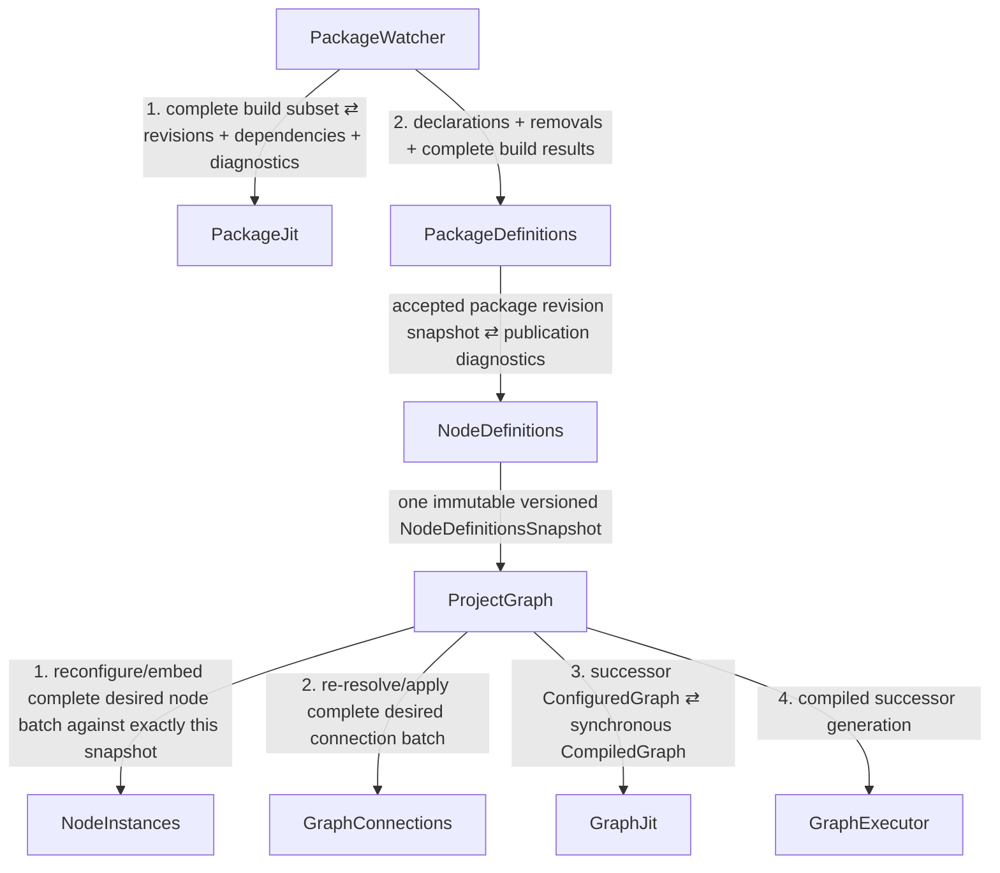
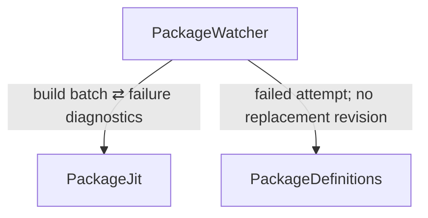
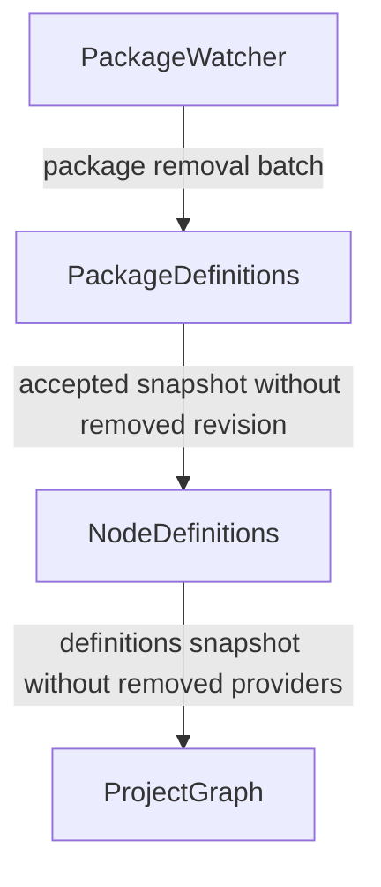
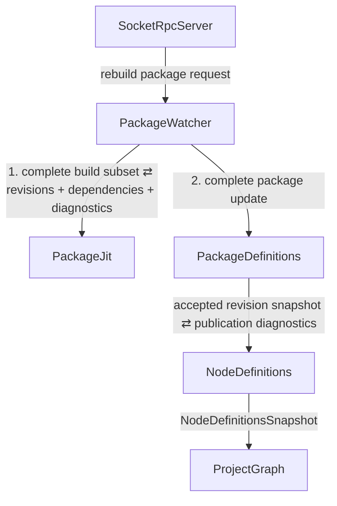

# Event Flow: Package Refresh

This procedure covers filesystem-triggered package refresh, initial package
builds, and explicit rebuild requests. Every package build cause passes through
`PackageWatcher` because a successful build can discover a new dependency set
and therefore change filesystem state owned by that module.

The detailed ownership model is defined in
[../package_pipeline_architecture.md](../package_pipeline_architecture.md).

## Normal filesystem-triggered propagation tree



The numeric labels on sibling edges are orchestration order inside their parent;
they do not make the sibling modules call one another.

## PackageWatcher transaction

`PackageWatcher` coalesces the source cause into one affected package batch. It
owns package discovery/dependency/source watch state and invokes `PackageJit`
once for the complete build subset.

`PackageJit` returns successful immutable package revisions, failure diagnostics,
and dependency sets synchronously. It does not publish those results itself.

Before continuing downstream, `PackageWatcher` updates its `inotify` dependency
coverage from the returned successful revisions. It then invokes
`PackageDefinitions` exactly once with the complete transaction state:

- detected declaration additions/changes;
- package removals;
- successful built package revisions;
- failed build attempts and diagnostics.

This is why a newly discovered package is not first published as “discovered”
and then published again as “built” during the same cause.

## Accepted revision update

`PackageDefinitions` owns the application package catalog and accepted successful
package revisions.

A failed build leaves the previous accepted revision live and updates only the
latest attempt/status. If the accepted revision set did not change, propagation
may stop there.

A successful build or package removal changes the accepted snapshot.
`PackageDefinitions` invokes `NodeDefinitions` once with the complete accepted
revision set.

`NodeDefinitions` derives the global leaf/module definition namespace and may
return publication/collision diagnostics synchronously over that same edge. It
does not call back into `PackageDefinitions`.

If the global namespace changes, one immutable `NodeDefinitionsSnapshot` reaches
`ProjectGraph`, which starts one normal root-graph rebuild transaction.

## Failed build

A failed build does not disturb the running graph merely because source files
changed:



The previous accepted package revision remains current. No new
`NodeDefinitionsSnapshot` is required unless some other item in the same batched
refresh changed the accepted package set.

## Package removal

A removal can change accepted package state without compiling anything:



Requested node instances remain desired in `NodeInstances`; definitions that
vanished simply make the corresponding desired instances unresolved until a
matching definition returns.

## Explicit rebuild

Explicit/manual rebuilds also enter through `PackageWatcher`:



This path is intentional even though the root cause is not an `inotify` event:
all builds may alter dependency watches, so all builds pass through the owner of
that state.

## Tree invariant

The static package-side application graph needed by these procedures is acyclic:

```text
PackageWatcher
    +-> PackageJit
    `-> PackageDefinitions
            `-> NodeDefinitions
                    `-> ProjectGraph
```

Build results and publication diagnostics may move back through request/response
objects on existing edges. No reverse app-module control edge is required.
