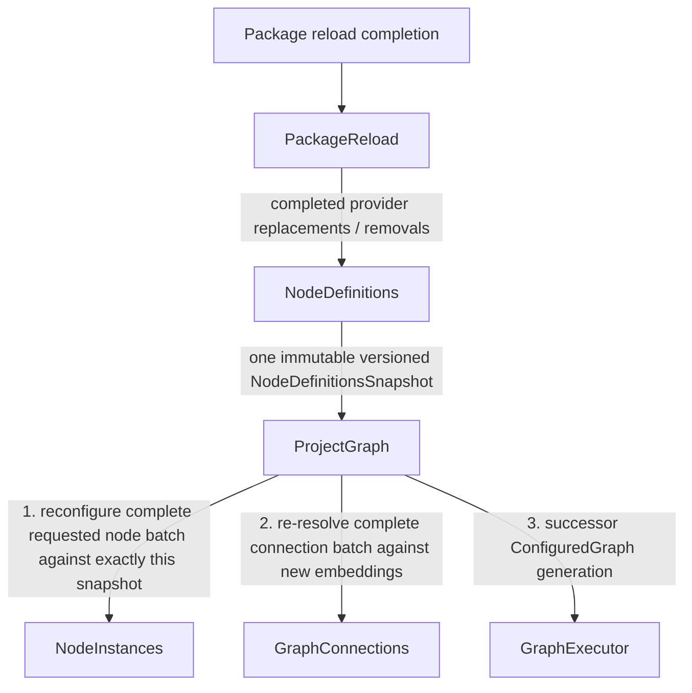

# Event Flow: Package Reload

This procedure starts when package compilation/reload work has completed and a
new provider batch is ready to be applied. Raw filesystem notifications and
asynchronous compilation scheduling may occur earlier and are not part of this
synchronous propagation.

## Propagation tree

## Data movement

`PackageReload` owns reload/build completion and publishes provider-level
changes. `NodeDefinitions` reconciles those changes into a complete immutable
registry snapshot.

`ProjectGraph` stores that snapshot as the current definition world and starts
one root rebuild using its unchanged desired project graph state.

The snapshot is passed once to `NodeInstances`. `NodeInstances` may internally
preserve configured cache entries whose provider/version dependencies are
unchanged and rebuild only affected cache entries, but all recursive definition
resolution for this invocation uses this exact snapshot.

No nested configuration call re-enters `NodeDefinitions`.

`GraphConnections` is invoked only after the entire requested instance set has
been embedded. Connections whose path no longer resolves become dangling; they
are retained so that the same stable path can resolve again in a later reload.

The resulting complete graph generation is submitted once to `GraphExecutor`.

## Async source separation

Filesystem discovery/change detection and expensive package compilation should
not keep one application propagation open. Completion of background work starts
this new propagation as a new cause.

This separation prevents flows such as project replay -> package compilation ->
project graph rebuild from re-entering a module already reached by the project
replay cause.

## Derived read models and notifications

If `NodeSourceIntrospection` needs to observe this change, `ProjectGraph` should
update it once using the combined state/result already available in the root-build
transaction. Do not preserve separate definition-side and instance-side paths
that converge on the read model.

Any asynchronous UI notification to `SocketRpcServer` that would re-enter an
incoming RPC/reload propagation must be published only after the current cause
unwinds, as a new cause.
