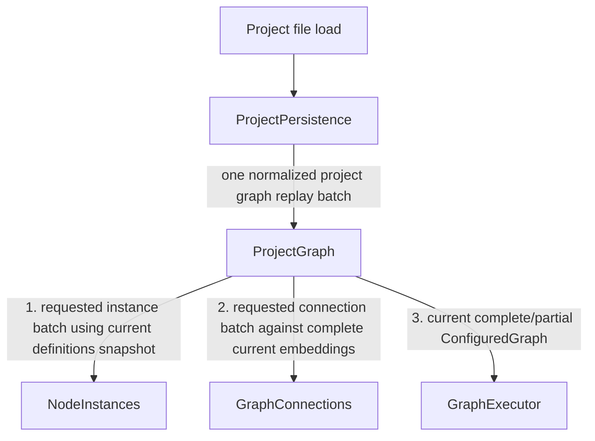
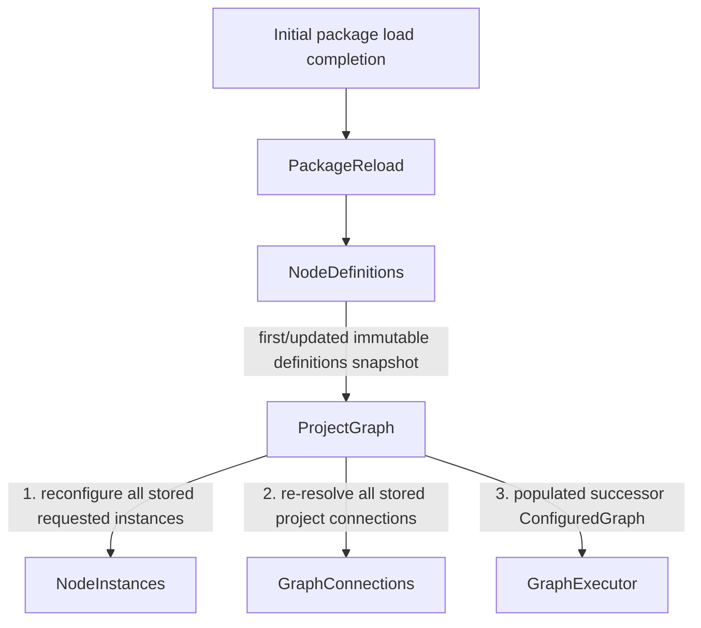

# Event Flow: Startup And Project Replay

Startup intentionally consists of separate causes rather than one giant
propagation tree. Project replay may complete before IV package providers are
available. Unresolved node instances and connections are a valid initialized
state.

## 1. Project file replay

`ProjectPersistence` reconstructs canonical project intent. It does not become
the owner of that graph state.

The current definitions snapshot may be empty or incomplete. `NodeInstances`
retains unresolved requested instances/diagnostics, and `GraphConnections`
retains dangling requested matchers. This is valid server state.

Other persistent domains such as toolchain overrides, system-device settings,
or future presentation state should be replayed through their owning modules in
separate batched procedures where necessary. Do not create one broad replay
propagation whose branches later converge on the same module.

## 2. Initial package load completion

When initial package build/reload work later completes, it starts a new cause:

The desired project state did not change, so this second procedure does not
route back through `ProjectPersistence`.

## Startup ordering rule

All app modules and bridges must exist before sources capable of emitting these
procedures are started. Asynchronous compilation completion must begin a new
propagation after the initiating scheduling event has unwound.
