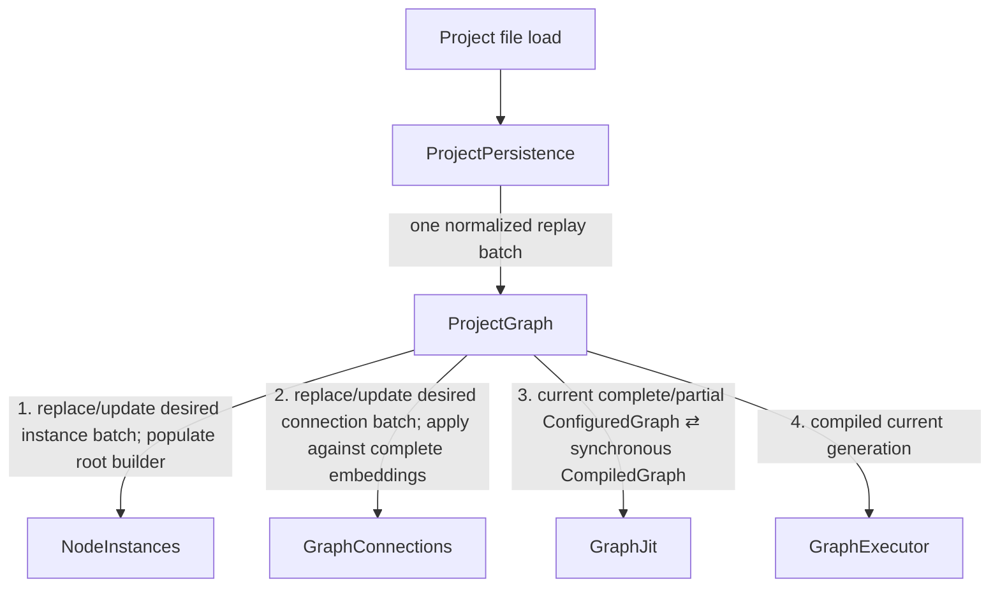
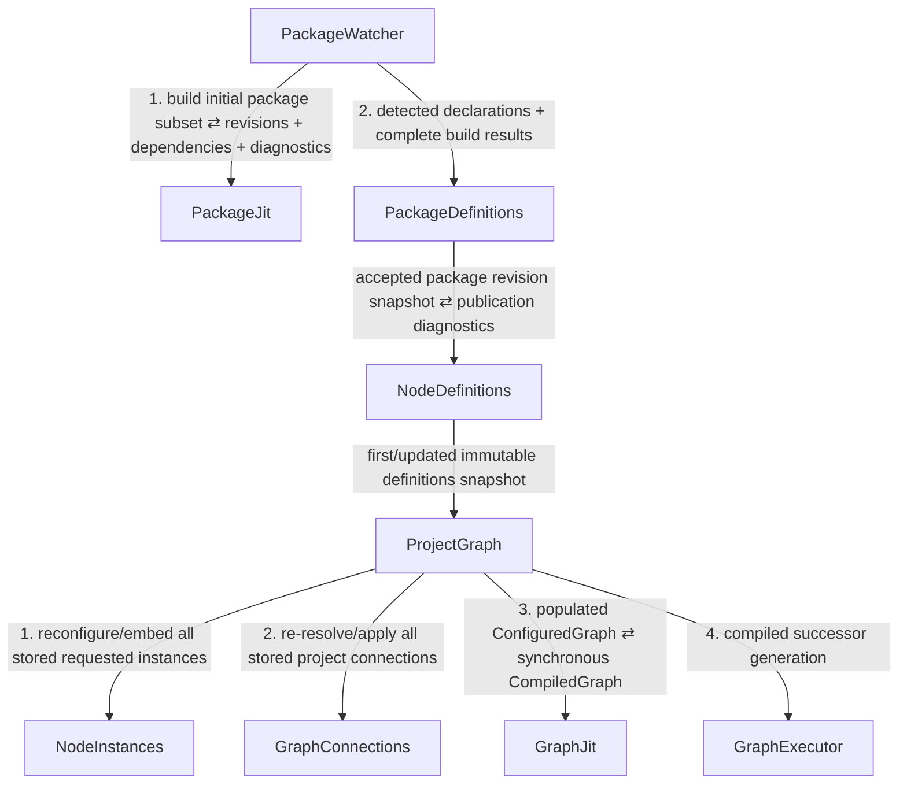

# Event Flow: Startup And Project Replay

Startup intentionally consists of separate causes rather than one giant
propagation tree. Project replay may complete before IV package providers are
available. Unresolved node instances and connections are a valid initialized
state.

## 1. Project file replay

`ProjectPersistence` reconstructs persistent data but does not become the owner
of graph intent. `NodeInstances` owns the replayed desired instance state and
`GraphConnections` owns the replayed desired connection state. `ProjectGraph`
only orchestrates the one coherent root-build transaction.

The current definitions snapshot may be empty or incomplete. `NodeInstances`
retains unresolved requested instances/diagnostics, and `GraphConnections`
retains dangling requested matchers. This is valid server state.

Other persistent domains such as toolchain overrides, system-device settings,
or future presentation state should be replayed through their owning modules in
separate batched procedures where necessary. Do not create one broad replay
propagation whose branches later converge on the same module.

## 2. Initial package discovery/build

After startup enables Linux package watching/discovery, `PackageWatcher`
originates a separate cause for the initially discovered package batch:

`PackageWatcher` updates its dependency-watch state from the synchronous
`PackageJit` result before invoking `PackageDefinitions`. The desired
instance/connection state did not change, so this procedure does not route back
through `ProjectPersistence`.

## Startup ordering rule

All app modules and bridges must exist before sources capable of emitting these
procedures are started. Project replay should complete before package-source
causes are allowed to mutate package/definition state if deterministic startup
ordering requires that separation.

Within one package-source cause, `PackageWatcher` invokes `PackageJit` at most
once for the complete build subset and then invokes `PackageDefinitions` exactly
once with the completed package transaction. Whole-project `GraphJit` compilation
is likewise synchronous inside the later `ProjectGraph` transaction.
