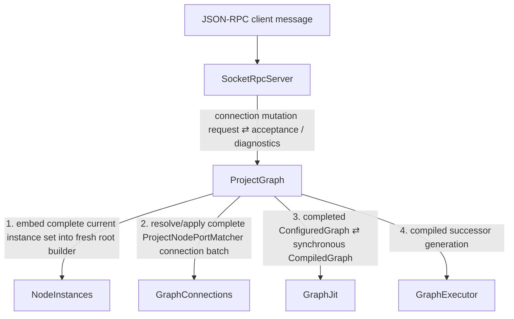

# Event Flow: User Connection Mutation

This procedure covers user creation, deletion, or replacement of project-wide
connections expressed through `ProjectNodePortMatcher`s.

## Propagation tree

## Why `NodeInstances` still runs

A connection-only mutation still creates a fresh root builder. The cached node
instances are immutable subgraphs, so `NodeInstances` should normally reuse them
and perform cheap embedding rather than re-running configuration.

The new root embedding produces a fresh translation from each external
instance id and cached local handle to parent-builder handles. `GraphConnections`
needs this translation before it can resolve recursive matchers.

There is intentionally no separate incremental connection-only root graph path
for the initial implementation. After connection application, `ProjectGraph`
finishes the root graph, synchronously recompiles it through `GraphJit`, and then
offers the resulting `CompiledGraph` to `GraphExecutor`.

## Matcher semantics

`GraphConnections` resolves the stored structured path through nested virtual
nodes, ordered direct members, tiled child selectors, nested subgraph scopes,
and finally the named port/optional port channel selector.

Output-side matcher results contribute source channels and are summed according
to normal graph semantics. The resulting source is applied/broadcast to the
input-side matcher results. Explicit source/target channel type information is
validated as part of the connection.

Zero matches leave a dangling desired connection; they do not remove project
state.

## Derived read models and notifications

If `NodeSourceIntrospection` needs to observe this change, `ProjectGraph` should
update it once using the combined state/result already available in the root-build
transaction. Do not preserve separate definition-side and instance-side paths
that converge on the read model.

Any asynchronous UI notification to `SocketRpcServer` that would re-enter an
incoming RPC/reload propagation must be published only after the current cause
unwinds, as a new cause.
