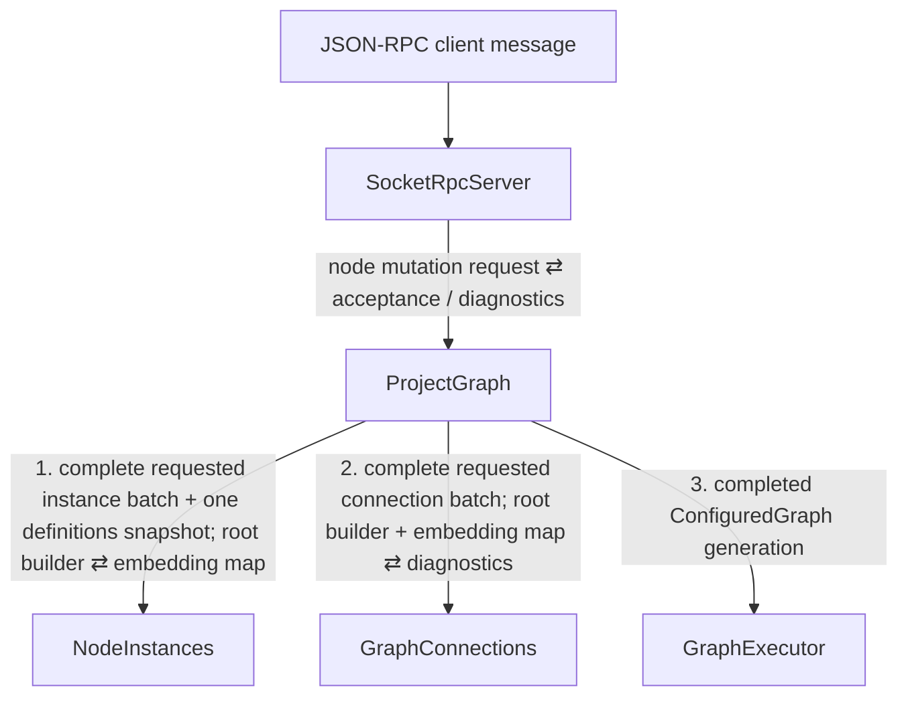

# Event Flow: User Node Mutation

This procedure covers user-initiated create, delete, duplicate, or
reconfiguration of a project-owned node instance through JSON-RPC.

## Propagation tree

`NodeInstances`, `GraphConnections`, and `GraphExecutor` are sibling children of
`ProjectGraph`. The labels `1`, `2`, and `3` specify the order in which
`ProjectGraph` invokes them inside one handler.

## Data movement

`SocketRpcServer` converts the wire request into a typed mutation request and
forwards it to `ProjectGraph`. It does not own project state.

`ProjectGraph` first updates its durable desired state. It then starts exactly
one root-build transaction using:

- the complete current project-owned node-instance declaration batch;
- the complete current project-owned connection declaration batch; and
- the latest immutable `NodeDefinitionsSnapshot` already delivered to
  `ProjectGraph` by the package/definition flow.

`NodeInstances` receives that one definitions snapshot and uses it for the
entire batch, including every nested `g.node(...)` call. It resolves cache hits,
configures cache misses, embeds all requested instances into the supplied root
builder, and returns one complete instance-id -> embedding map plus batched
diagnostics.

Only after that invocation returns does `ProjectGraph` invoke
`GraphConnections`. `GraphConnections` resolves all stored
`ProjectNodePortMatcher`s against the complete embedding map and applies every
resolvable cross-node connection to the same root builder.

`ProjectGraph` then finishes the root builder and submits one completed
`ConfiguredGraph` generation to `GraphExecutor`.

## Failure semantics

A user mutation can remain valid desired project state even when its current
configuration cannot be produced. Examples include a temporarily unavailable
definition or a C++ configuration expression that fails to compile.

The mutation should therefore produce diagnostics/unresolved state rather than
silently deleting the requested node or its dangling project connections.

The JSON-RPC response may acknowledge acceptance of desired state without
waiting for LLVM compilation or realtime activation of the resulting successor
generation.

## Derived read models and notifications

If `NodeSourceIntrospection` needs to observe this change, `ProjectGraph` should
update it once using the combined state/result already available in the root-build
transaction. Do not preserve separate definition-side and instance-side paths
that converge on the read model.

Any asynchronous UI notification to `SocketRpcServer` that would re-enter an
incoming RPC/reload propagation must be published only after the current cause
unwinds, as a new cause.
