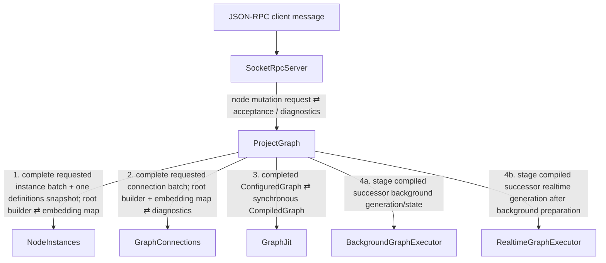

# Event Flow: User Node Mutation

This procedure covers user-initiated create, delete, duplicate, or
reconfiguration of a project-owned node instance through JSON-RPC.

## Propagation tree

```mermaid
flowchart TD
    SRC["JSON-RPC client message"]
    RPC["SocketRpcServer"]
    PG["ProjectGraph"]
    NI["NodeInstances"]
    GC["GraphConnections"]
    GJ["GraphJit"]
    RGE["RealtimeGraphExecutor"]
    BGE["BackgroundGraphExecutor"]

    SRC --> RPC
    RPC -->|"node mutation request ⇄ acceptance / diagnostics"| PG
    PG -->|"1. complete requested instance batch + one definitions snapshot; root builder ⇄ embedding map"| NI
    PG -->|"2. complete requested connection batch; root builder + embedding map ⇄ diagnostics"| GC
    PG -->|"3. completed ConfiguredGraph ⇄ synchronous CompiledGraph"| GJ
    PG -->|"4a. stage compiled successor background generation/state"| BGE
    PG -->|"4b. stage compiled successor realtime generation after background preparation"| RGE
```

`NodeInstances`, `GraphConnections`, `GraphJit`, `RealtimeGraphExecutor`, and
`BackgroundGraphExecutor` are sibling children of `ProjectGraph` for this cause.
The labels specify orchestration order inside one `ProjectGraph` handler. After the
synchronous `GraphJit` request returns one immutable `CompiledGraph`, `ProjectGraph`
stages its background half first. Only after `BackgroundGraphExecutor` has prepared
the generation/cutover resources does `ProjectGraph` stage the corresponding realtime
half. Both remain sibling child operations; the ordering does not make either executor
the parent of the other.

## Data movement

`SocketRpcServer` converts the wire request into a typed mutation request and
forwards it to `ProjectGraph`. It does not own project state.

`ProjectGraph` forwards the typed mutation to `NodeInstances` during the one
root-build transaction. `NodeInstances` owns and updates the desired instance set;
`GraphConnections` independently owns the desired connection set. `ProjectGraph`
does not retain duplicate copies of either domain.

The transaction uses the latest immutable `NodeDefinitionsSnapshot` already
delivered to `ProjectGraph` by the package/definition flow.

`NodeInstances` receives that one definitions snapshot and uses it for the
entire batch, including every nested `g.node(...)` call. It resolves cache hits,
configures cache misses, embeds all requested instances into the supplied root
builder, and returns one complete instance-id -> embedding map plus batched
diagnostics.

Only after that invocation returns does `ProjectGraph` invoke
`GraphConnections`. `GraphConnections` resolves all stored
`ProjectNodePortMatcher`s against the complete embedding map and applies every
resolvable cross-node connection to the same root builder.

`ProjectGraph` then finishes the root builder, synchronously asks `GraphJit` to
compile that exact `ConfiguredGraph`/definition generation into one immutable
`CompiledGraph`, and then stages the compiled successor in `BackgroundGraphExecutor` first and
`RealtimeGraphExecutor` second. Actual logical activation is deferred until a later
realtime pass boundary, where realtime publishes an allocation-free prepared cutover
to background before swapping to the successor realtime generation.

## Failure semantics

A user mutation can remain valid desired project state even when its current
configuration cannot be produced. Examples include a temporarily unavailable
definition or a C++ configuration expression that fails to compile.

The mutation should therefore produce diagnostics/unresolved state rather than
silently deleting the requested node or its dangling project connections.

The root-build transaction, including `GraphJit`, is synchronous with the
mutation handler. A JSON-RPC result may therefore include graph-JIT diagnostics.
It still does not wait for activation of the compiled successor. Background staging
prepares the successor first; logical cutover occurs only at a legal
`RealtimeGraphExecutor` pass boundary and is published to `BackgroundGraphExecutor`
as a separate source invocation.

## Derived read models and notifications

If `IvModuleSourceIntrospection` needs to observe this change, `ProjectGraph` should
update it once using the combined state/result already available in the root-build
transaction. Do not preserve separate definition-side and instance-side paths
that converge on the read model.

Any asynchronous UI notification to `SocketRpcServer` that would re-enter an
incoming RPC/reload propagation must be published only after the current cause
unwinds, as a new cause.
