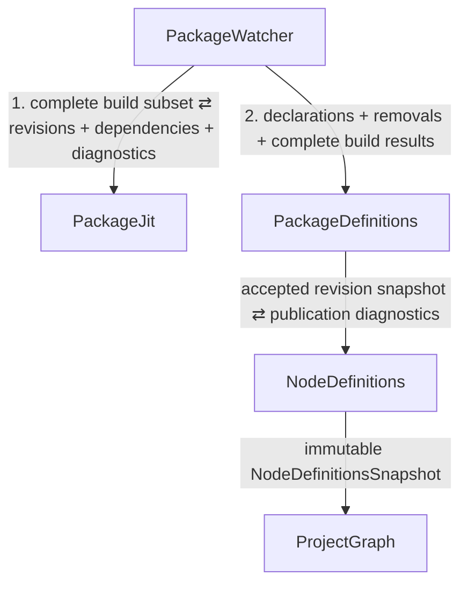
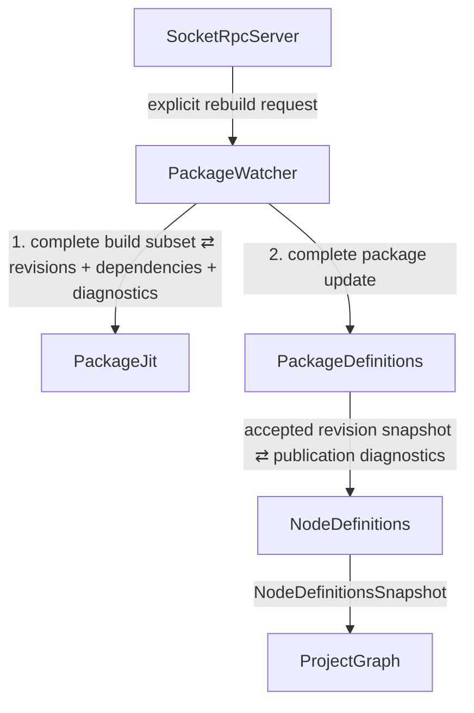

# Package Pipeline Application Architecture

_Status: current authoritative design for package discovery, package construction,
accepted package revisions, and publication of the global node-definition
namespace._

This document defines the package-side application-module pipeline that feeds the
project graph. It supersedes older descriptions in which `PackageReload` owns
filesystem watching, package compilation/JIT state, accepted package revisions,
or publishes provider candidates directly to `NodeDefinitions`.

Related documents:

- [project_graph_application_architecture.md](./project_graph_application_architecture.md)
- [node_definitions_and_instances_direction.md](./node_definitions_and_instances_direction.md)
- [event_propagation_tree_constraint.md](./event_propagation_tree_constraint.md)
- [event_flows/package_refresh.md](./event_flows/package_refresh.md)
- [startup_realization_order.md](./startup_realization_order.md)

## Pipeline overview

The package side needs three application modules before the downstream global
node-definition registry:

| Module | Primary responsibility |
| --- | --- |
| `PackageWatcher` | own package source/watch state and coordinate one complete package-refresh transaction for every build cause |
| `PackageJit` | synchronously build/JIT one requested package batch into self-contained immutable package revision results |
| `PackageDefinitions` | own the application package catalog and the currently accepted successful revision of every package |
| `NodeDefinitions` | derive the immutable global node-definition namespace from the accepted package revisions |

There is deliberately **no fourth package coordinator app module**. The target
static app-module graph is:

```text
PackageWatcher
    +-> PackageJit
    `-> PackageDefinitions
            `-> NodeDefinitions
                    `-> ProjectGraph
```

For one refresh transaction, the two `PackageWatcher` children are invoked in
order: first `PackageJit`, then `PackageDefinitions`. They remain siblings in the
event-propagation tree.

This arrangement is intentional because package compilation produces dependency
information that changes the filesystem watch set. The module that owns that
watch set must therefore participate in every package-build cause. Returning
build results to `PackageWatcher` over the existing request/response edge is
simpler and safer than introducing a separate coordinator and then routing watch
updates back into the watcher.

## Package roots and build-artifact ownership (planned)

Package discovery has three distinct source scopes for a project. A package is
identified by its own `iv_package.json`; an IV project is rooted at its
`iv_project.json` (or the supported `iv_project.jsonl` form). The scopes are:

| Source scope | Source ownership | Intended build-artifact owner |
| --- | --- | --- |
| Built-in packages | The executable/build or installed Intravenous distribution | The executable's build tree, or installation-associated prebuilt artifact/cache location |
| Common packages | Zero or more configured shared package directories | A shared package cache independent of any project |
| Project-local packages | The current IV project's source tree | That project's `build/iv/` tree |

These are **package search scopes**, not three separate JIT implementations.
`PackageWatcher` discovers packages from all applicable scopes, `PackageJit`
uses the same package compilation/finalization contract for all of them, and
`PackageDefinitions`/`NodeDefinitions` publish the accepted revisions into the
project's definition snapshot. Scope/provenance must remain explicit; a built-in
package is not reclassified as project-local simply because its source directory
is not in a user-configured common root. Overlapping search roots must not cause
one package to be discovered or compiled twice. Definition-ID
collisions across distinct packages remain an explicit namespace/publication
matter, not an implicit source-directory precedence rule.

### Built-ins belong to the executable, not the opened project

The build that produces an executable should also produce its built-in package
LLVM and associated reusable build outputs using that executable's configured
package toolchain. A build-tree executable should find those artifacts under its
own CMake build tree; an installed executable needs an installation-associated
prebuilt location or a versioned writable cache rather than assuming the
original build directory still exists. Merely staging built-in **sources** into
the build tree does not satisfy this artifact-location contract.

Every project opened by a compatible executable should reuse the same built-in
package artifacts. Opening a project must not create a built-in build workspace
under the built-in source directory or under that project's `build/iv/`. This is
"once per compatible executable build", not "once forever": changes to the
built-in source, package ABI, relevant compiler/finalizer/introspection tooling,
target architecture, or build configuration must invalidate the artifact.
Normal cache hits should avoid C++ compilation and LLVM package finalization;
loading a package revision into a process's package/configuration ORC JIT is a
separate operation and is not guaranteed to be a disk-cache hit.

Common packages may be shared across projects using a cache keyed by package
identity/source revision and relevant toolchain/ABI settings. Project-local
packages retain project-owned build workspaces. Neither kind of package needs a
second implementation of `PackageJit`, and reusing package LLVM does not imply
reusing a project's configured graph or `GraphJit`-compiled generation.

**Current implementation boundary:** CMake stages the built-in manifest and
entry source under its binary tree and exposes that directory through
`iv_package_search_root`. `ModuleLoader` currently treats all configured extra
search roots as global and places their build workspaces under
`IV_GLOBAL_MODULE_CACHE` (or its platform default); project-local workspaces
use `<project>/build/iv/`. Dedicated executable-owned built-in artifacts,
explicit three-scope provenance, and build/install-time prebuilding are future
package-pipeline work. This section does not change the current loader or the
ongoing `GraphJit` implementation plan.

## `PackageWatcher`

`PackageWatcher` has a broader responsibility than merely wrapping `inotify`:

> Maintain knowledge of package source locations and determine when one package
> refresh transaction is required.

It owns operational source state such as:

- package discovery roots;
- Linux `inotify` watch descriptors;
- the currently detected package declarations;
- dependency watch sets returned by successful package builds;
- path-to-package mappings;
- dirty/coalesced package IDs;
- enough source/declaration state to construct one complete refresh request.

A small non-app-module service/support object may own the blocking filesystem
thread and process lifecycle. The app module owns the package-source state and
refresh semantics.

On Linux, steady-state filesystem detection should be event-driven. Existing
known-package dependency watching already uses `inotify`; the remaining periodic
package-root discovery scan is a migration TODO and should also become
`inotify`-driven. Blocking on an `inotify` descriptor with `poll`/`epoll`, and
using an optional one-shot `timerfd` to coalesce bursts, is event-driven and is
not filesystem polling.

### One refresh transaction

When a source cause occurs, `PackageWatcher` performs one transaction:

1. coalesce filesystem/discovery/manual-build input into the complete affected
   package batch;
2. invoke `PackageJit` at most once for the complete build subset;
3. receive the complete build results synchronously;
4. update dependency/path watches from the returned successful results;
5. invoke `PackageDefinitions` exactly once with the complete application-level
   package update: detected declaration changes, removals, successful revisions,
   and failed build attempts.

If the transaction contains only removals and no package needs to be built, the
`PackageJit` invocation may be omitted. It must never be split into multiple
per-package JIT calls that expose partial downstream state.

A newly discovered package therefore does **not** produce this sequence:

```text
PackageWatcher
    -> PackageDefinitions   // discovered
    -> PackageJit
    -> PackageDefinitions   // built
```

because `PackageDefinitions` would be entered twice for one cause. Instead the
package is discovered, built, and then included in one complete
`PackageDefinitions` update.

### Every build cause enters through `PackageWatcher`

An explicit/manual rebuild is not literally a filesystem-watch event, but it
still enters through `PackageWatcher`:

```text
SocketRpcServer
    -> PackageWatcher
        +-> PackageJit
        `-> PackageDefinitions
```

This is required because any package build can discover a changed dependency set
and therefore alter the state owned by `PackageWatcher`.

Initial package discovery follows the same rule:

```text
startup source
    -> PackageWatcher
        +-> PackageJit
        `-> PackageDefinitions
```

Keeping all build causes on this path makes the static wiring acyclic and keeps
watch-state updates inside the owner of that state.

`PackageSources` is a possible future name if `PackageWatcher` proves too narrow,
but no additional coordinator module is required to express the responsibility.

## `PackageJit`

`PackageJit` is a synchronous request/response app module:

> Compile one requested batch of package source declarations into self-contained
> package revision results.

Conceptually:

```cpp
PackageJitBatchResult PackageJit::build(
    PackageJitBatchRequest const &request);
```

It owns:

- the persistent `ModuleLoader`;
- the package/configuration ORC `LLJIT`;
- generation-specific `JITDylib`/resource tracking;
- compiler/build caches and toolchain/compiler implementation state;
- package build/compiler invocation;
- loading/finalizing retained package LLVM;
- extraction of module-node and leaf-node providers;
- dependency discovery produced by the build;
- build/JIT diagnostics.

It does **not** own:

- which packages currently exist;
- which packages are dirty;
- filesystem watching;
- which package revision is currently accepted by the application;
- the global node-definition namespace.

`PackageJit` does not emit an event to `PackageDefinitions`. It returns its whole
batch result to its parent `PackageWatcher`.

A successful result contains enough state to survive independently as an
accepted package revision. Conceptually:

```cpp
struct PackageRevision {
    PackageId package_id;
    PackageRevisionId revision;

    std::vector<ModuleNodeProvider> module_definitions;
    std::vector<LeafNodeProvider> leaf_definitions;

    std::vector<ModuleRef> lifetime_refs;

    // Used by PackageWatcher to update inotify coverage.
    std::vector<std::filesystem::path> dependencies;
};
```

“Self-contained” is a lifetime guarantee, not a requirement to copy native code
out of ORC. The lifetime handles may pin the relevant `JITDylib`/resource
tracker and retained LLVM/code/data owned by the persistent `PackageJit` state.

A failed result contains diagnostics/status and no replacement package revision.

## `PackageDefinitions`

`PackageDefinitions` is the application-level package registry:

> Own the package catalog and the currently accepted successful revision of each
> package.

It owns application state such as:

- known/detected package declarations used by the package catalog;
- the current accepted `PackageRevision` per package;
- immutable/versioned package-registry snapshots;
- the latest build attempt/status for each package;
- the latest build diagnostics;
- global-publication diagnostics returned by `NodeDefinitions`.

The operational watcher copy of detected declarations is not a competing source
of application truth: `PackageWatcher` needs source declarations to maintain
filesystem state, while `PackageDefinitions` retains the corresponding
application/package-catalog state.

Applying one watcher transaction is atomic at this boundary. Downstream modules
must never observe per-package intermediate states from one logical batch.

Suppose package `foo` currently has accepted revision 12.

If a rebuild fails:

```text
detected package foo
accepted revision = 12
latest build attempt = failed
```

revision 12 remains live. Since the accepted revision set did not change,
`PackageDefinitions` need not invoke `NodeDefinitions` for a new global namespace
generation.

If a later rebuild succeeds:

```text
accepted revision = 13
latest build attempt = successful
```

`PackageDefinitions` atomically replaces revision 12 with revision 13 and invokes
`NodeDefinitions` once with the new complete accepted-revision snapshot.

Package removal immediately removes that package's accepted revision and also
produces a new accepted-revision snapshot.

## `NodeDefinitions`

`NodeDefinitions` is derived from `PackageDefinitions`; it is not the package
registry.

Its responsibility is:

> Derive one immutable global node-definition namespace from the currently
> accepted package revisions.

It owns:

- global `definition_id -> provider` mapping;
- one namespace shared by module-node and leaf-node definitions;
- `NodeDefinitionsSnapshot` generation/versioning;
- per-provider versions;
- cross-package definition-ID collision state.

It should no longer own:

- discovered or retained package declarations;
- package roots;
- package build candidates/queues;
- package build statuses;
- accepted package revision selection;
- package reload policy.

Given:

```text
package A/rev7:
    module node "foo"
    leaf node "osc"

package B/rev3:
    module node "bar"
```

it derives:

```text
foo -> A/rev7
osc -> A/rev7
bar -> B/rev3
```

If A and B both publish `foo`, both package revisions remain legitimate package
build products in `PackageDefinitions`; the ambiguity exists specifically in the
global namespace owned by `NodeDefinitions`.

### Publication diagnostics return through the same edge

There is no event cycle:

```text
PackageDefinitions
    -> NodeDefinitions
        -> PackageDefinitions   // forbidden
```

Instead the one call exchanges data in both directions:

```text
PackageDefinitions
       |
       | accepted package revisions
       v
NodeDefinitions
       |
       | global publication diagnostics
       ^
       |
PackageDefinitions
```

Control flow enters `NodeDefinitions` once. `PackageDefinitions` may store the
returned collision/publication diagnostics for package UI/reporting.

## Normal filesystem-triggered tree



After `PackageJit` returns and before `PackageDefinitions` is invoked,
`PackageWatcher` updates its dependency watch state from the returned successful
revisions. No reverse app-module edge is necessary.

If the accepted revision set does not change, the tree may stop at
`PackageDefinitions`.

## Explicit rebuild tree

An explicit rebuild still goes through `PackageWatcher` so build-produced
dependency changes are committed by their owner:



The static package-side graph remains acyclic for both filesystem and manual
build causes.

## Current implementation checkpoint

The package-side app-module split described above has landed:

- `PackageWatcher` owns discovered/retained declarations, dirty state, dependency
  watches, and coordinates each complete refresh transaction;
- `PackageJit` owns `ModuleLoader`, package ORC/JIT/compiler state, and returns
  self-contained immutable `PackageRevision` results synchronously;
- `PackageDefinitions` owns the package catalog, accepted successful revisions,
  build diagnostics/status, and immutable accepted-revision snapshots;
- `NodeDefinitions` consumes those snapshots and owns only the derived global
  definition namespace plus namespace-publication diagnostics;
- linker-set control flow follows `PackageWatcher -> PackageJit`, then
  `PackageWatcher -> PackageDefinitions -> NodeDefinitions`, with diagnostics
  returned synchronously over the last request/response edge.

There is no `PackageReload` application module or `IvPackageDefinitions`
application module anymore. The old package-definition change event remains only
as a temporary compatibility projection from `NodeDefinitions` to module-source
introspection. `NodeInstances` has moved to the immutable
`NodeDefinitionsSnapshot` edge and no longer consumes that legacy diff.

The remaining package-side migration item is package-root discovery.
`PackageWatcherService` still performs the temporary periodic discovery scan; the
dependency watcher itself is event-driven on Linux. Replace the root scan with
event-driven Linux discovery without changing the app-module ownership or event
topology above.

With this package pipeline coherent, later graph-side app modules can depend on
its final event topology.
